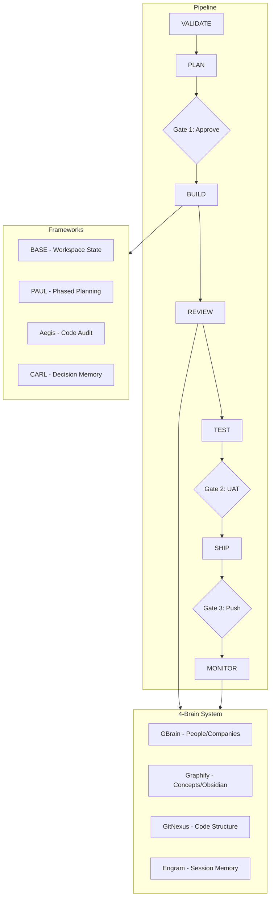

# ftitos-claude-code

**Production-grade Claude Code setup: autonomous sprint pipeline, 4-brain memory, 7-specialist review army.**


## What This Is

A complete Claude Code configuration that turns a bare workspace into a self-managing development environment. It installs agents, skills, rules, hooks, pipeline commands, and 4 framework integrations (BASE, PAUL, Aegis, CARL) so that a single `/project:sprint validate` command runs your project from validation through shipping with only 3 human checkpoints.

## What Makes This Different

| Feature | Generic setups | ftitos-claude-code |
|---------|---------------|-------------------|
| Pipeline | Manual phase triggers | Autonomous VALIDATE to SHIP (one command) |
| Memory | Basic MCP | 4-brain system (GBrain + Graphify + GitNexus + Engram) |
| Decisions | None | CARL (queryable decision memory with domain-scoped rules) |
| Project lifecycle | None | BASE + PAUL + Aegis (workspace, planning, audit) |
| Edit safety | None | GateGuard (must read before edit) |
| Code review | Single pass | Review Army (2-7 parallel specialists + adversarial council) |
| AI output quality | No checks | 17-item anti-slop blacklist |
| Context survival | Lost on compact | Auto-checkpoint + recovery |

## Quick Start

```bash
# 1. Clone
git clone https://github.com/ftitos/ftitos-claude-code.git
cd ftitos-claude-code

# 2. Install
./install.sh

# 3. Verify
npm run doctor
```

The installer copies agents, skills, rules, hooks, and pipeline commands into your `~/.claude/` directory. `doctor.js` checks that every component installed correctly.

## Architecture



## Components

### Agents (20)

| Agent | Purpose |
|-------|---------|
| architect | System design, module decomposition, dependency analysis |
| debugger | Stack trace diagnosis, root cause analysis |
| security-reviewer | OWASP checks, auth bypass detection, secrets scanning |
| code-reviewer | Style enforcement, complexity analysis, dead code detection |
| tdd-guide | Red-green-refactor coaching, coverage gap identification |
| performance-analyst | N+1 detection, bundle size analysis, memory profiling |
| api-designer | Contract validation, versioning, breaking change detection |
| data-modeler | Schema design, migration safety, index planning |
| explorer | Codebase search, file discovery, dependency mapping |
| planner | Implementation strategy, task breakdown, risk assessment |
| refactorer | Extract/inline/rename refactoring with blast radius analysis |
| documenter | API docs, architecture decision records, inline comments |
| test-writer | Unit/integration/E2E test generation following TDD |
| migration-specialist | Database migration review, rollback planning |
| ci-specialist | Pipeline configuration, build optimization |
| dependency-auditor | CVE scanning, license compliance, upgrade planning |
| config-manager | Environment setup, feature flags, secrets management |
| accessibility-reviewer | WCAG 2.1 AA compliance, keyboard navigation, screen reader |
| devops-engineer | Deployment config, infrastructure, monitoring setup |
| general-purpose | Multi-step research, open-ended tasks, miscellaneous |

### Skills (40)

| Category | Count | Examples |
|----------|-------|---------|
| TDD & Testing | 6 | tdd-workflow, coverage-check, test-isolation |
| Security | 4 | security-audit, secrets-scan, dependency-audit, cso |
| Code Review | 5 | review-army, review-council, code-review, lint-check |
| Brain System | 4 | brain-query, brain-ingest, brain-search, brain-status |
| Project Management | 8 | project-init, sprint, status, plan, build, review, ship, monitor |
| Pipeline | 5 | validate, gate-check, phase-transition, rollback, canary |
| Documentation | 3 | document-release, changelog, architecture-record |
| Utilities | 5 | compact-context, recover-context, health-check, clean, doctor |

### Rules (16)

| Category | Count | Covers |
|----------|-------|--------|
| Common | 12 | Coding style, git workflow, testing, security, performance, anti-slop, agents, development workflow, review army, review council |
| Python | 4 | Python-specific linting, type hints, virtual environments, pytest conventions |

### Hooks (25)

| Category | Count | Purpose |
|----------|-------|---------|
| PreToolUse | 9 | GateGuard (block edit before read), destructive bash confirmation, sensitive path protection |
| PostToolUse | 5 | Auto-save to Engram, compliance tracking |
| PreCompact | 1 | Checkpoint context before compaction |
| PostCompact | 1 | Restore critical context after compaction |
| SessionStart | 4 | Load brain context, recover checkpoints, load instincts |
| SessionEnd | 2 | Save session summary, sync decisions |
| Stop | 1 | Capture learnings on agent stop |
| UserPromptSubmit | 3 | Input validation, context enrichment |

## Pipeline Overview

The sprint pipeline runs autonomously between 3 human gates:

```
VALIDATE (auto) --> PLAN --> [Gate 1: Approve] --> BUILD (auto) --> REVIEW (auto) --> TEST --> [Gate 2: UAT] --> SHIP --> [Gate 3: Push] --> MONITOR (auto)
```


Pink nodes are the 3 human gates. Everything else runs without intervention.

**Start a sprint:** `/project:sprint validate`
**Check progress:** `/project:status`

## 4-Brain System

| Engine | Version | Answers | MCP Tools | Data Sources |
|--------|---------|---------|-----------|-------------|
| GBrain | 0.10.x | WHO + WHY (people, companies, relationships) | 30+ | LinkedIn, web, CRM |
| Graphify | 0.4.x | WHAT + HOW (concepts, knowledge graphs) | 7 | Obsidian, markdown |
| GitNexus | 1.6.x | WHERE + IMPACT (code structure, blast radius) | 16 | Git repos, AST |
| Engram | 1.12.x | LEARNED (session memory, cross-session recall) | 11 | Session history |

Access all four through the `/brain <query>` command, which routes to the appropriate engine.

## Frameworks

### BASE (Workspace State)

Manages workspace configuration, project registry, and operator profile. Lives in `~/.base/` with 9 data surfaces. Tracks which projects are active, their locations, and their current state.

### PAUL (Phased Planning)

Structures project work into phases with explicit deliverables. Each project gets a `.paul/` directory containing phase definitions, progress tracking, and dependency mapping. Phases chain automatically through the pipeline.

### Aegis (Code Audit)

Runs structured audits against project code. Checks for security issues, test coverage, code quality, and compliance with project rules. Results feed into the REVIEW phase of the sprint pipeline.

### CARL (Decision Memory)

Queryable decision log with domain-scoped rules. Every architectural decision, tradeoff, and rationale is recorded and searchable. Decisions can be promoted to permanent rules. Accessed via MCP tools.

## Guides

See the [`guides/`](guides/) directory for detailed documentation:

- **Quickstart** -- Get running in under 5 minutes
- **Architecture** -- Full system design and component relationships
- **Hackathon Playbook** -- Speed-run setup for time-constrained events
- **Adding Agents** -- How to create and register new agents
- **Adding Skills** -- How to create and register new skills
- **Writing Rules** -- Rule format, scoping, and best practices

## Contributing

### Adding an Agent

1. Create a JSON file in `agents/` following the agent schema
2. Run `npm run validate:agents` to check syntax
3. Run `npm run doctor` to verify integration

### Adding a Skill

1. Create a markdown file in `skills/<category>/`
2. Register it in the skill manifest
3. Run `npm run validate:skills` to check syntax

### Adding a Rule

1. Create a markdown file in `rules/common/` or `rules/<language>/`
2. Follow the existing rule format (heading, bullet list, examples)
3. Run `npm run doctor` to verify

### Adding a Hook

1. Add the hook script to `hooks/scripts/`
2. Register it in the hooks configuration
3. Run `npm run validate:hooks` to check syntax

## License

[MIT](LICENSE)
