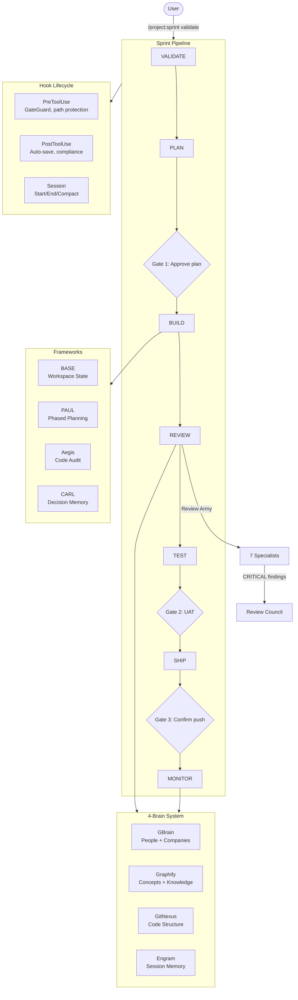

# ftitos-claude-code

**An autonomous engineering harness for Claude Code.**

[](CHANGELOG.md)
[](LICENSE)
[](./)
[](./)
[](./)
[](./)
[](./)
[](https://claude.ai/code)

A Claude Code configuration that packages 20 agents, 40 skills, 15 rules, and 25 lifecycle hooks into an installable bundle. One command (`/project:sprint validate`) runs a project from validation through shipping with only 3 human checkpoints. The rest is autonomous -- build, review, test, and monitor phases execute without intervention.

---

## Credits / Built On

This harness is a derivative of two Anthropic projects:

| Source | What we took |
|--------|-------------|
| [everything-claude-code](https://github.com/anthropics/everything-claude-code) (159K stars) | Foundation architecture. Hook lifecycle model, agent dispatch patterns, skill registration format. |
| [claude-code-best-practice](https://github.com/anthropics/claude-code-best-practice) | Reference patterns for rules, context management, and project structure. |

**Specific patterns adopted:**

- **GateGuard hooks** -- the read-before-edit enforcement model from ECC, extended with backup-on-edit and sensitive path protection.
- **Review Army structure** -- ECC's multi-specialist dispatch pattern, expanded to 7 specialists with confidence thresholds and severity mapping.
- **Anti-slop rules** -- ECC's output quality checks, formalized into a 17-item blacklist covering UI, copy, and code patterns.
- **Context recovery** -- ECC's compaction survival approach, implemented as PreCompact checkpoint + PostCompact restore hooks.

This project extends ECC's patterns with 4 framework integrations (BASE, PAUL, Aegis, CARL), a 4-brain MCP system, and an adversarial review council. It does not replace ECC -- it builds on top of it.

---

## What Makes This Different

| Feature | Generic setups | ftitos-claude-code |
|---------|---------------|-------------------|
| Pipeline | Manual phase triggers | Autonomous VALIDATE-to-SHIP (one command) |
| Memory | Basic MCP | 4-brain system (GBrain + Graphify + GitNexus + Engram) |
| Decisions | None | CARL (queryable decision log with domain-scoped rules) |
| Project lifecycle | None | BASE + PAUL + Aegis (workspace, planning, audit) |
| Edit safety | None | GateGuard (must read before edit, backup on write) |
| Code review | Single pass | Review Army (2-7 parallel specialists + adversarial council) |
| AI output quality | No checks | 17-item anti-slop blacklist |
| Context survival | Lost on compact | Auto-checkpoint + recovery |

---

## Quick Start

```bash
# 1. Clone
git clone https://github.com/nassimbf/ftitos-claude-code.git
cd ftitos-claude-code

# 2. Install (copies agents, skills, rules, hooks, commands into ~/.claude/)
./install.sh

# 3. Verify (checks every component installed correctly)
npm run doctor
```

Requirements: Node.js 18+, Claude Code CLI. Zero external npm dependencies.

---

## Architecture



---

## Components at a Glance

### Agents (20)

| Agent | Role |
|-------|------|
| architect | System design, module decomposition, dependency analysis |
| backend-developer | Server-side implementation, API development |
| build-error-resolver | Build failure diagnosis and fix |
| code-reviewer | Style enforcement, complexity analysis, dead code detection |
| constitutional-validator | Rule compliance verification |
| data-analyst | Data exploration, statistical analysis |
| debugger | Stack trace diagnosis, root cause analysis |
| doc-updater | Documentation generation and maintenance |
| e2e-runner | End-to-end test execution and reporting |
| fullstack-developer | Cross-stack implementation |
| performance-engineer | N+1 detection, bundle analysis, memory profiling |
| planner | Implementation strategy, task breakdown, risk assessment |
| product-manager | Requirements clarification, scope definition |
| prompt-engineer | Prompt design and optimization |
| python-reviewer | Python-specific code review (PEP8, type hints, pytest) |
| qa-expert | Test strategy, coverage analysis, edge case identification |
| refactor-cleaner | Extract/inline/rename with blast radius analysis |
| research-analyst | Multi-source research, synthesis, citation |
| security-reviewer | OWASP checks, auth bypass detection, secrets scanning |
| tdd-guide | Red-green-refactor coaching, coverage gap identification |

### Skills (40, by category)

| Category | Count | Examples |
|----------|-------|---------|
| TDD and Testing | 6 | tdd-workflow, python-testing, e2e-testing, eval-harness |
| Security | 3 | security-review, ai-regression-testing, verification-loop |
| Code Review | 3 | code-review, coding-standards, skill-comply |
| Architecture | 5 | hexagonal-architecture, api-design, backend-patterns, frontend-patterns |
| Agent and AI Patterns | 7 | agentic-engineering, autonomous-loops, dispatching-parallel-agents, cost-aware-llm-pipeline |
| Project and Product | 4 | product-lens, codebase-onboarding, brainstorming, deep-research |
| DevOps and Deployment | 4 | deployment-patterns, docker-patterns, canary-watch, browser-qa |
| Context and Memory | 3 | context-budget, strategic-compact, search-first |
| Language-Specific | 3 | python-patterns, django-patterns, mcp-server-patterns |
| Utilities | 2 | git-workflow, markdown-mermaid-writing |

### Rules (15)

| Scope | Count | Covers |
|-------|-------|--------|
| Common | 10 | Coding style, git workflow, testing, security, performance, anti-slop, agents, development workflow, review army, review council |
| Python | 5 | Linting, type hints, virtual environments, pytest conventions, hooks |

### Hooks (25, by lifecycle event)

| Event | Count | What they do |
|-------|-------|-------------|
| PreToolUse | 9 | GateGuard (block edit before read), destructive bash confirmation, sensitive path protection, dev server blocking |
| PostToolUse | 5 | Auto-save to Engram, compliance tracking, console.log detection |
| PreCompact | 1 | Checkpoint context before compaction |
| PostCompact | 1 | Restore critical context after compaction |
| SessionStart | 4 | Load brain context, recover checkpoints, load cross-session learnings |
| SessionEnd | 2 | Save session summary, evaluate session quality |
| Stop | 1 | Capture learnings on agent stop |
| UserPromptSubmit | 3 | Input validation, context enrichment, compact suggestion |

---

## Sprint Pipeline

Three human gates. Everything between them is autonomous.


| Gate | What happens | User action |
|------|-------------|-------------|
| Gate 1 | PLAN generates `PLAN.md` + `CONTEXT.md` with scope, tasks, risks | Review plan, type `approve` |
| Gate 2 | BUILD + REVIEW + TEST complete. Code compiles, tests pass, review army clears | Test the product, type `approved` |
| Gate 3 | SHIP packages the release, generates changelog | Confirm push, type `ship` |

**Start a sprint:** `/project:sprint validate`
**Check progress:** `/project:status`

---

## 4-Brain System

Four MCP-based engines, each answering a different question class. Accessed via `/brain <query>`, which routes to the correct engine.

| Engine | Version | Answers | MCP Tools | Sources |
|--------|---------|---------|-----------|---------|
| GBrain | 0.10.x | WHO + WHY (people, companies, relationships) | 30+ | LinkedIn, web, CRM |
| Graphify | 0.4.x | WHAT + HOW (concepts, knowledge graphs) | 7 | Obsidian, markdown |
| GitNexus | 1.6.x | WHERE + IMPACT (code structure, blast radius) | 16 | Git repos, AST |
| Engram | 1.12.x | LEARNED (session memory, cross-session recall) | 11 | Session history |

---

## Frameworks

**BASE** -- Workspace state management. Tracks project registry, operator profile, and satellite repos. Lives in `~/.base/` with 9 data surfaces. Answers "what projects exist and where are they?"

**PAUL** -- Phased project planning. Each project gets a `.paul/` directory with phase definitions, deliverables, progress tracking, and dependency mapping. Phases chain automatically through the sprint pipeline.

**Aegis** -- Structured code audit. Runs security, coverage, quality, and compliance checks against project code. Results feed directly into the REVIEW phase. Flags issues with severity levels and fix recommendations.

**CARL** -- Decision memory via MCP. Every architectural decision, tradeoff, and rationale is recorded with domain scoping and recall keywords. Decisions are searchable across sessions and can be promoted to permanent rules.

---

## Review Army

The REVIEW phase dispatches 2-7 specialist agents in parallel based on what changed in the diff. Each specialist has a focused checklist, a confidence threshold (7-8/10 minimum), and severity mapping.

| Specialist | Dispatched when | Checks |
|-----------|----------------|--------|
| Security | Auth or backend code changed | Injection, auth bypass, IDOR, secrets, SSRF, XSS, CSRF |
| Performance | 50+ lines changed in frontend/backend | N+1 queries, unbounded loops, missing indexes, memory leaks |
| Data Migration | Migration files changed | Reversibility, data loss risk, zero-downtime compatibility, lock duration |
| API Contract | API code changed | Breaking changes, versioning, error consistency, rate limiting |
| Testing | 50+ lines changed | Coverage gaps, flaky patterns, mock boundaries, assertion quality |
| Maintainability | 50+ lines changed | Function/file size, nesting depth, dead code, DRY violations |
| Design/UX | Frontend code changed | WCAG 2.1 AA, responsive design, loading states, empty states |

### Review Council (Santa Method)

When any specialist flags a **CRITICAL** finding, two independent reviewer agents are spawned in parallel. Neither can see the other's output (anti-anchoring). The decision matrix:

| Reviewer A | Reviewer B | Outcome |
|------------|------------|---------|
| CONFIRM | CONFIRM | Blocks ship |
| CONFIRM | DISMISS | Escalate to user with both arguments |
| DISMISS | CONFIRM | Escalate to user with both arguments |
| DISMISS | DISMISS | Downgrade to MEDIUM, does not block |

This prevents false positives from blocking releases and prevents groupthink from missing real issues.

---

## GateGuard

A set of PreToolUse hooks that enforce discipline at the tool level:

- **Read-before-edit**: Blocks `Edit` and `Write` calls on any file that has not been `Read` in the current session. Prevents confidently modifying code you have not looked at.
- **Backup-on-edit**: Creates a backup before destructive edits.
- **Sensitive path protection**: Blocks writes to `.env`, `*.pem`, `*.key`, `credentials.*`, and other secret-containing paths.
- **Dev server blocking**: Prevents launching dev servers outside tmux sessions (avoids orphaned processes).
- **Destructive bash confirmation**: Requires explicit confirmation before `rm -rf`, `git reset --hard`, and similar commands.

---

## Directory Structure

```
ftitos-claude-code/
├── agents/                # 20 specialist agent definitions (.md)
├── skills/                # 40 skill directories (each with SKILL.md)
├── rules/
│   ├── common/            # 10 language-agnostic rules
│   └── python/            # 5 Python-specific rules
├── hooks/
│   ├── hooks.json         # Hook registration (25 entries)
│   └── scripts/           # Hook implementations (.js)
├── commands/              # Slash command definitions
├── brain/                 # 4-brain MCP architecture docs
├── frameworks/            # BASE, PAUL, Aegis, CARL docs
├── pipeline/              # Sprint pipeline phase docs
├── guides/                # Setup and usage guides
├── examples/              # Example CLAUDE.md for different project types
├── templates/             # Project manifest and context templates
├── scripts/
│   ├── install-apply.js   # Installer logic
│   ├── uninstall.js       # Clean removal
│   ├── doctor.js          # Health check (validates all components)
│   ├── diff-scope.sh      # Review Army scope detection
│   └── ci/                # CI validation scripts
├── tests/                 # Test suite
├── .github/workflows/     # GitHub Actions CI
├── install.sh             # Entry point
├── ETHOS.md               # 6 builder principles
├── AGENTS.md              # Agent dispatch rules
├── CHANGELOG.md           # Release history
└── LICENSE                # MIT
```

---

## Guides

| Guide | Description |
|-------|-------------|
| [Quickstart](guides/quickstart.md) | Install and verify in under 5 minutes |
| [Architecture](guides/architecture.md) | Full system design, component relationships, data flow |
| [Brain System](guides/brain-system.md) | 4-brain MCP setup, routing, and usage |
| [Hackathon Playbook](guides/hackathon-playbook.md) | Speed-run setup for time-constrained events |
| [Customization](guides/customization.md) | Adding agents, skills, rules, and hooks |

---

## Contributing

### Adding an Agent

1. Create `agents/<agent-name>.md` with role description, checklist, and dispatch conditions.
2. Run `node scripts/ci/validate-agents.js` to verify.

### Adding a Skill

1. Create `skills/<skill-name>/SKILL.md` with frontmatter (`name`, `description`) and instructions.
2. Run `node scripts/ci/validate-skills.js` to verify.

### Adding a Rule

1. Create a `.md` file in `rules/common/` (language-agnostic) or `rules/<language>/` (language-specific).
2. Follow existing format: heading, bullet list, severity mapping where applicable.

### Adding a Hook

1. Add the hook script to `hooks/scripts/`.
2. Register it in `hooks/hooks.json` with `type`, `pattern`, and `command` fields.
3. Run `node scripts/ci/validate-hooks.js` to verify.

### Running Tests

```bash
node tests/run-all.js               # Full test suite
node scripts/ci/validate-agents.js   # Agent validation
node scripts/ci/validate-skills.js   # Skill validation
node scripts/ci/validate-hooks.js    # Hook validation
./install.sh --dry-run               # Installer dry run
```

---

## License

[MIT](LICENSE)
