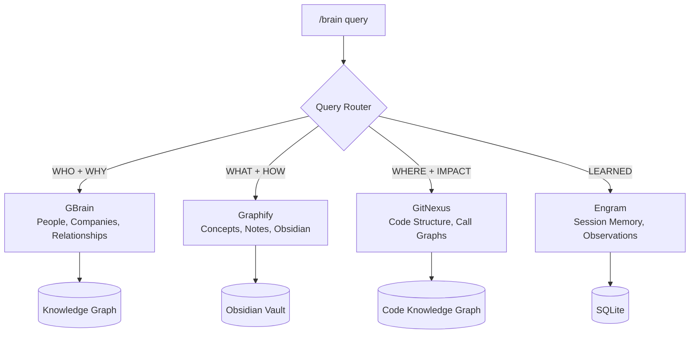

# Brain System -- 4-Engine Knowledge Architecture

The brain system is a set of four MCP servers, each responsible for a different type of knowledge. Together they provide persistent, queryable memory across sessions.

## Architecture

## The Four Engines

| Engine | Version | Responsibility | Storage | MCP Tools |
|--------|---------|---------------|---------|-----------|
| GBrain | 0.10.2 | WHO + WHY: people, companies, relationships, entity context | Knowledge graph | 30+ |
| Graphify | 0.4.21 | WHAT + HOW: concepts, linked notes, Obsidian integration | Obsidian vault | 7 |
| GitNexus | 1.6.1 | WHERE + IMPACT: code structure, call graphs, blast radius | Kuzu code knowledge graph | 16 |
| Engram | 1.12.0 | LEARNED: session memory, observations, cross-session recall | SQLite | 11 |

## Routing

The `/brain <query>` command routes to the right engine based on query intent:

- **"Who built the auth module?"** --> GBrain (people)
- **"How does materiality calculation work?"** --> Graphify (concepts)
- **"What calls validateUser()?"** --> GitNexus (code)
- **"What did we decide about caching last week?"** --> Engram (memory)

## When to Use Each Engine

### GBrain -- Entity Intelligence

Use when you need context about people, companies, or relationships. GBrain maintains a knowledge graph of entities with observations and relations.

- Track who works on what
- Store company context and key contacts
- Map relationships between entities
- Query entity history and observations

### Graphify -- Concept Mapping

Use when you need to understand or document concepts, architecture, or domain knowledge. Graphify integrates with Obsidian for linked-note knowledge management.

- Create and query concept notes
- Build linked knowledge graphs
- Document architecture decisions
- Map domain concepts to implementation

### GitNexus -- Code Intelligence

Use when you need to understand code structure, trace execution flows, or assess change impact. GitNexus indexes repositories into a queryable knowledge graph.

- Query execution flows and call chains
- Assess blast radius before making changes
- Find all callers/callees of a function
- Detect affected processes from uncommitted changes
- Run Cypher queries against the code graph
- Map API routes to handlers and consumers

### Engram -- Session Memory

Use when you need continuity across sessions. Engram stores observations, decisions, and learnings that persist beyond a single conversation.

- Save observations after completing work
- Search past session context
- Track session summaries
- Capture passive learnings from task output

## Setup

Each engine runs as an independent MCP server. See the individual setup guides:

- [GBrain setup](gbrain-setup.md)
- [Graphify setup](graphify-setup.md)
- [GitNexus setup](gitnexus-setup.md)
- [Engram setup](engram-setup.md)

All four are registered in `~/.claude.json` under `mcpServers`.

## Integration with Frameworks

- **BASE**: Brain engines provide context for BASE grooming and workspace health checks
- **PAUL**: GitNexus traces help during PAUL plan/verify phases. Engram provides session continuity for multi-phase projects.
- **Aegis**: GitNexus impact analysis supports Aegis audit findings. Code structure queries inform architecture domain audits.
- **CARL**: Engram observations can be promoted to CARL decisions through the staging pipeline.
