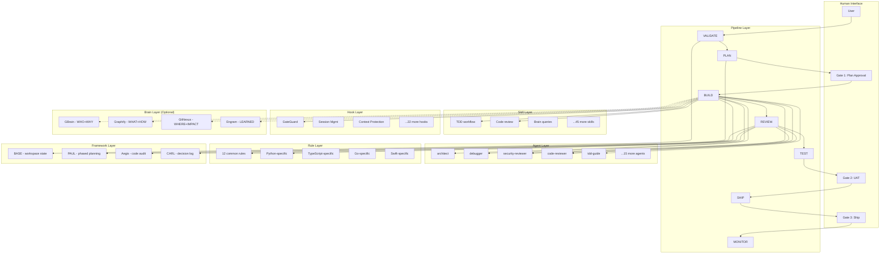

# Architecture Guide

How all the components fit together to create an autonomous development pipeline.

---

## System Diagram



---

## Layer Breakdown

### 1. Pipeline Layer

The pipeline is the backbone. It defines the order of operations for any feature or fix.

```
VALIDATE -> PLAN -> [Gate 1] -> BUILD -> REVIEW -> TEST -> [Gate 2] -> SHIP -> [Gate 3] -> MONITOR
```

**7 phases, 3 human gates.** Everything between gates runs autonomously.

| Phase | What Happens | Auto/Manual |
|-------|-------------|-------------|
| VALIDATE | Check project structure, deps, state | Auto |
| PLAN | Generate PLAN.md with tasks and phases | Auto, then Gate 1 |
| BUILD | TDD loop: write tests, implement, repeat | Auto |
| REVIEW | 7-specialist parallel review + council | Auto |
| TEST | Run full test suite, check 80% coverage | Auto |
| UAT | User tests the product | Gate 2 |
| SHIP | Commit, tag, prepare release | Auto, then Gate 3 |
| MONITOR | Post-ship canary checks | Auto |

Commands: `/project:init`, `/project:sprint`, `/project:status`, `/project:review`, `/project:ship`

Pipeline definitions live in `pipeline/phases/`.

---

### 2. Agent Layer

20 specialized subagents, each with a defined role and model assignment.

**Model allocation:**

| Model | Use Case | Agents |
|-------|----------|--------|
| claude-haiku-4-5 | Classification, routing, simple extraction | Worker agents |
| claude-sonnet-4-6 | Reasoning, code review, main conversation | Most agents |
| claude-opus-4-6 | Complex orchestration | architect, orchestrator |

**Key agents:**

| Agent | Role | Dispatched When |
|-------|------|----------------|
| architect | System design, component planning | New features, structural changes |
| debugger | Stack trace analysis, root cause | Test failures, runtime errors |
| security-reviewer | OWASP checks, auth audit | Auth code, API endpoints, input handling |
| code-reviewer | Style, maintainability, patterns | Post-build review phase |
| tdd-guide | Test-first workflow enforcement | Build phase |
| performance-reviewer | N+1, bundle size, memory leaks | Large changesets (50+ lines) |
| api-contract-reviewer | Breaking changes, versioning | API endpoint changes |
| migration-reviewer | Data loss, rollback, locking | Database migrations |

Agent definitions live in `agents/`. Each agent is a Markdown file with:

- Role description
- Model assignment
- Dispatch conditions
- Checklist items

---

### 3. Skill Layer

48 skills that provide workflow automations triggered by slash commands.

Each skill is a directory containing:

```
skills/skill-name/
  SKILL.md          # Trigger definition, instructions
  hooks/            # Optional: pre/post hooks for the skill
```

**Key skills:**

| Skill | Trigger | Purpose |
|-------|---------|---------|
| tdd | `/tdd` | Full TDD cycle: red, green, refactor |
| code-review | `/code-review` | Multi-specialist review |
| browser-qa | `/qa` | Playwright-based visual QA |
| canary-watch | `/canary` | Post-deploy monitoring |
| brain | `/brain` | Route queries to the right brain engine |
| codebase-onboarding | `/onboard` | Analyze and summarize a new codebase |

Skill definitions live in `skills/`.

---

### 4. Rule Layer

Rules are behavioral constraints that Claude follows in every interaction. They are not optional — they override default behavior.

**Common rules (apply to all languages):**

| Rule File | Purpose |
|-----------|---------|
| coding-style.md | Immutability, file/function size limits, naming |
| testing.md | TDD mandatory, 80% coverage, pytest, no mocking internals |
| security.md | No secrets, parameterized SQL, XSS/CSRF prevention |
| git-workflow.md | Conventional commits, atomic commits, PR workflow |
| development-workflow.md | Research -> Plan -> TDD -> Implement -> Review -> Commit |
| anti-slop.md | 17-item blacklist of generic AI output patterns |
| performance.md | Model selection, context management, profiling |
| review-army.md | 7 parallel specialist reviewers |
| review-council.md | Santa Method adversarial validation for CRITICALs |
| agents.md | Agent dispatch rules, parallel execution |

**Language-specific rules** (loaded when the corresponding language is detected):

- `python/` — pytest conventions, type hints, packaging
- `typescript/` — strict mode, ESLint, import style
- `golang/` — error handling, naming, package layout
- `swift/` — Swift conventions, SwiftUI patterns

Rule files live in `rules/common/` and `rules/<language>/`.

---

### 5. Hook Layer

25 hooks that fire on specific events in the Claude Code session lifecycle.

**Hook types and counts:**

| Event | Count | Key Hooks |
|-------|-------|-----------|
| PreToolUse | 9 | GateGuard (blocks Edit/Write on unread files) |
| PostToolUse | 5 | Auto-save observations after significant actions |
| PreCompact | 1 | Checkpoint context before compaction |
| PostCompact | 1 | Recover critical context after compaction |
| SessionStart | 4 | Load instincts, check project state |
| SessionEnd | 2 | Save session summary, flush memory |
| Stop | 1 | Final cleanup |
| UserPromptSubmit | 3 | Input validation, context budget check |

**GateGuard** is the most important hook. It intercepts Edit and Write tool calls and blocks them if the target file has not been read in the current session. This prevents blind edits to files the agent has not reviewed.

Hook definitions live in `hooks/`. Hook scripts live in `hooks/scripts/`.

---

### 6. Framework Layer

4 frameworks that manage workspace state, planning, auditing, and decision logging.

| Framework | Purpose | Location | Managed By |
|-----------|---------|----------|------------|
| BASE | Workspace state: project registry, operator profile, data surfaces | `.base/` | `/base:*` commands |
| PAUL | Phased planning: task breakdown, phase progression, completion tracking | `.paul/` per project | `/paul:*` commands |
| Aegis | Code audit: pre-commit checks, security scan, coverage validation | `.aegis/` per project | `/aegis:*` commands |
| CARL | Decision logging: architectural decisions, rationale, recall keywords | `.carl/` via MCP | CARL MCP tools |

Framework configs and templates live in `frameworks/`.

---

### 7. Brain Layer (Optional)

4 MCP-based memory engines that give Claude persistent knowledge across sessions.

| Engine | Domain | Question Types |
|--------|--------|---------------|
| GBrain | WHO + WHY | People, companies, relationships, motivations |
| Graphify | WHAT + HOW | Concepts, research findings, knowledge graphs |
| GitNexus | WHERE + IMPACT | Code structure, blast radius, execution flows |
| Engram | LEARNED | Session observations, cross-session learnings |

The `/brain` command routes queries to the appropriate engine based on the question type. All 4 are optional — the core system works without them, but they improve context retention across sessions.

Brain setup docs live in `brain/`. See the [Brain System Guide](./brain-system.md) for installation.

---

## How Components Interact

A typical feature build traverses components in this order:

1. **User** runs `/project:sprint validate`
2. **Pipeline** triggers VALIDATE phase
3. **BASE** checks project registry and workspace state
4. **Pipeline** chains to PLAN phase
5. **PAUL** generates `PLAN.md` with tasks and phases
6. **User** approves at Gate 1
7. **Pipeline** triggers BUILD phase
8. **TDD skill** drives the test-first loop
9. **Agents** (architect, tdd-guide) are dispatched for subtasks
10. **GateGuard hook** blocks edits to unread files
11. **Rules** enforce coding style, security, and naming
12. **Engram** saves session observations for future reference
13. **Pipeline** chains to REVIEW phase
14. **Review Army** dispatches 7 specialist agents in parallel
15. **Review Council** validates any CRITICAL findings with 2 independent reviewers
16. **Aegis** runs final audit
17. **Pipeline** chains to TEST phase
18. **Testing rules** enforce 80% coverage
19. **User** performs UAT at Gate 2
20. **Pipeline** triggers SHIP phase
21. **Git workflow rules** enforce conventional commits
22. **CARL** logs architectural decisions made during the sprint
23. **User** confirms at Gate 3
24. **Pipeline** triggers MONITOR phase (canary checks)
