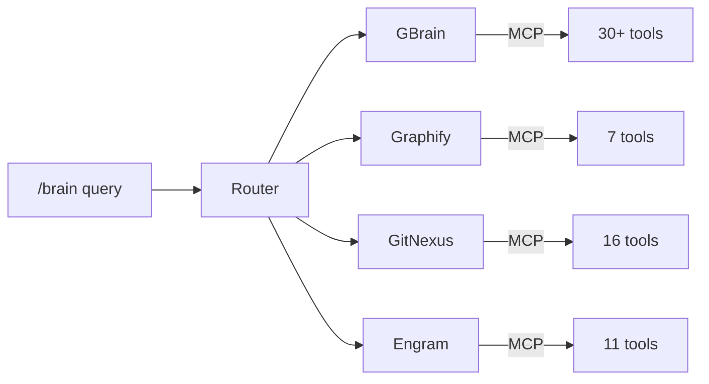

# Brain System Guide

The 4-brain architecture gives Claude persistent memory and structured knowledge across sessions.

---

## Why 4 Separate Engines

Each brain handles a different type of knowledge. Separating them means each engine can optimize for its domain without compromise.

| Engine | Domain | Question Pattern |
|--------|--------|-----------------|
| GBrain | WHO + WHY | "Who maintains the auth module?" / "Why did we choose Postgres?" |
| Graphify | WHAT + HOW | "What is our caching strategy?" / "How does the payment flow work?" |
| GitNexus | WHERE + IMPACT | "Where is the user validation logic?" / "What breaks if I change this function?" |
| Engram | LEARNED | "What did we fix last session?" / "What patterns have we established?" |

Without brains, Claude starts every session with zero context about your project history. With brains, it can recall past decisions, find code relationships, and build on previous work.

---

## Architecture Overview



Each brain runs as an MCP (Model Context Protocol) server. Claude communicates with them through MCP tool calls. The `/brain` command routes queries to the appropriate engine based on keyword matching.

---

## Engine Deep Dive

### GBrain — WHO + WHY

**Purpose:** Track people, companies, relationships, and the reasoning behind decisions.

**MCP tools:** 30+ tools covering entity management, relationship mapping, and decision retrieval.

**Use cases:**

- Record who made an architectural decision and why
- Track stakeholder relationships and contact info
- Map team member responsibilities to codebase areas
- Log meeting decisions with context

**Data model:** Graph-based. Entities (people, companies, projects) connected by typed relationships.

**Example queries:**

```
/brain who is responsible for the payment module?
/brain why did we switch from REST to GraphQL?
/brain what decisions has the team made about caching?
```

---

### Graphify — WHAT + HOW

**Purpose:** Manage conceptual knowledge, research findings, and structured documentation.

**MCP tools:** 7 tools for concept management, research indexing, and knowledge graph operations.

**Use cases:**

- Document how a complex system works (data flow, state machines, protocols)
- Store research findings from technology evaluations
- Build concept maps that connect ideas across projects
- Integrate with Obsidian vaults for bi-directional knowledge sync

**Data model:** Knowledge graph with typed concepts and relationships. Compatible with Obsidian markdown.

**Example queries:**

```
/brain what is our authentication flow?
/brain how does the event processing pipeline work?
/brain what research do we have on vector databases?
```

---

### GitNexus — WHERE + IMPACT

**Purpose:** Understand code structure, trace execution flows, and assess change impact.

**MCP tools:** 16 tools including:

| Tool | Purpose |
|------|---------|
| `query` | Search for code patterns and execution flows |
| `context` | 360-degree view of a symbol (callers, callees, processes) |
| `impact` | Blast radius analysis before making changes |
| `detect_changes` | Map uncommitted changes to affected flows |
| `rename` | Multi-file coordinated rename using the knowledge graph |
| `route_map` | API route mappings (handlers, consumers, middleware) |
| `cypher` | Raw Cypher queries against the code knowledge graph |

**Use cases:**

- Find all callers of a function before refactoring it
- Assess the blast radius of a change (what breaks at depth 1, 2, 3)
- Trace an API request from route handler to database query
- Detect which execution flows are affected by uncommitted changes

**Data model:** Code knowledge graph built from static analysis. Nodes are symbols (functions, classes, methods). Edges are relationships (CALLS, IMPORTS, EXTENDS, IMPLEMENTS).

**Example queries:**

```
/brain where is the user validation logic?
/brain what breaks if I rename the validateUser function?
/brain show me the execution flow for POST /api/users
```

---

### Engram — LEARNED

**Purpose:** Persistent session memory. Observations, learnings, and session summaries that carry forward.

**MCP tools:** 11 tools including:

| Tool | Purpose |
|------|---------|
| `mem_save` | Save an observation (decision, bugfix, pattern, discovery) |
| `mem_search` | Search past observations by keyword or natural language |
| `mem_context` | Get recent observations for context loading |
| `mem_session_start` / `mem_session_end` | Track session lifecycle |
| `mem_session_summary` | Save structured end-of-session summary |
| `mem_capture_passive` | Extract learnings from text output |

**Use cases:**

- Remember what was accomplished in the last session
- Recall how a tricky bug was fixed 3 weeks ago
- Track architectural decisions with rationale
- Load relevant context at the start of each session

**Data model:** Observations with title, content, type, project, and scope. Full-text searchable.

**Example queries:**

```
/brain what did we learn about rate limiting last week?
/brain what bugs have we fixed in the auth module?
/brain what was accomplished in the last session?
```

---

## Routing: How /brain Dispatches

The `/brain` command analyzes the query and routes to the right engine:

| Keywords / Patterns | Routes To |
|-------------------|-----------|
| who, person, team, company, stakeholder, why (decision) | GBrain |
| what (concept), how (process), research, architecture | Graphify |
| where (code), impact, blast radius, callers, rename, route | GitNexus |
| learned, session, observation, remember, last time, fixed | Engram |

If the query is ambiguous, it fans out to multiple engines and merges results.

You can also call engine tools directly without the router:

```
Use the engram mem_search tool to find observations about "authentication"
```

---

## Setup

### Required: Core MCP Servers (included in install)

These 5 servers are configured by the installer and work out of the box:

```json
{
  "context7": { "command": "npx", "args": ["-y", "@upstash/context7-mcp@latest"] },
  "memory": { "command": "npx", "args": ["-y", "@modelcontextprotocol/server-memory"] },
  "sequential-thinking": { "command": "npx", "args": ["-y", "@modelcontextprotocol/server-sequential-thinking"] },
  "playwright": { "command": "npx", "args": ["-y", "@anthropic-ai/mcp-server-playwright"] },
  "deepwiki": { "command": "npx", "args": ["-y", "@anthropic-ai/mcp-server-deepwiki"] }
}
```

### Optional: Brain MCP Servers

Each brain server needs to be installed separately. They are marked `"optional": true` in the MCP config — Claude Code will not fail if they are missing.

#### GBrain

```bash
# Install GBrain MCP server
mkdir -p ~/.gbrain
# Follow GBrain installation docs for mcp-server.js setup
```

Config added to `~/.claude.json`:

```json
{
  "gbrain": {
    "command": "node",
    "args": ["$HOME/.gbrain/mcp-server.js"],
    "optional": true
  }
}
```

#### Graphify

```bash
mkdir -p ~/.graphify
# Follow Graphify installation docs for mcp-server.js setup
```

Config:

```json
{
  "graphify": {
    "command": "node",
    "args": ["$HOME/.graphify/mcp-server.js"],
    "optional": true
  }
}
```

#### GitNexus

```bash
mkdir -p ~/.gitnexus
# Follow GitNexus installation docs for mcp-server.js setup
```

Config:

```json
{
  "gitnexus": {
    "command": "node",
    "args": ["$HOME/.gitnexus/mcp-server.js"],
    "optional": true
  }
}
```

#### Engram

```bash
mkdir -p ~/.engram
# Follow Engram installation docs for mcp-server.js setup
```

Config:

```json
{
  "engram": {
    "command": "node",
    "args": ["$HOME/.engram/mcp-server.js"],
    "optional": true
  }
}
```

### Verify Brain Installation

After installing any brain server, restart Claude Code and run:

```
List available MCP tools
```

You should see the brain's tools listed. For example, Engram adds `mem_save`, `mem_search`, `mem_context`, etc.

---

## Optional vs Required

The core system (agents, skills, rules, hooks, pipeline, frameworks) works without any brain servers. The brains add persistent memory, but they are not required.

**Without brains:**

- Claude starts each session with no memory of previous sessions
- Code structure analysis relies on file search (Grep/Glob) instead of a knowledge graph
- Decisions must be re-explained each session
- The pipeline, TDD, review, and shipping workflows all work normally

**With brains:**

- Session context carries forward automatically
- Code changes can be analyzed for blast radius before committing
- Past decisions and their rationale are searchable
- Research and findings persist across projects

Start without brains. Add them when you notice you are repeatedly re-explaining context or losing track of past decisions.
