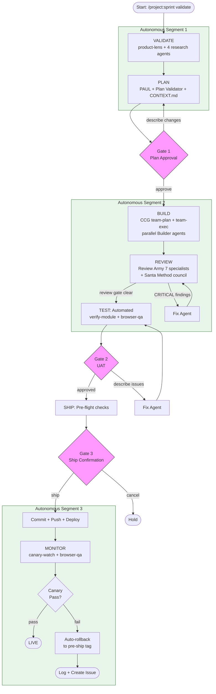
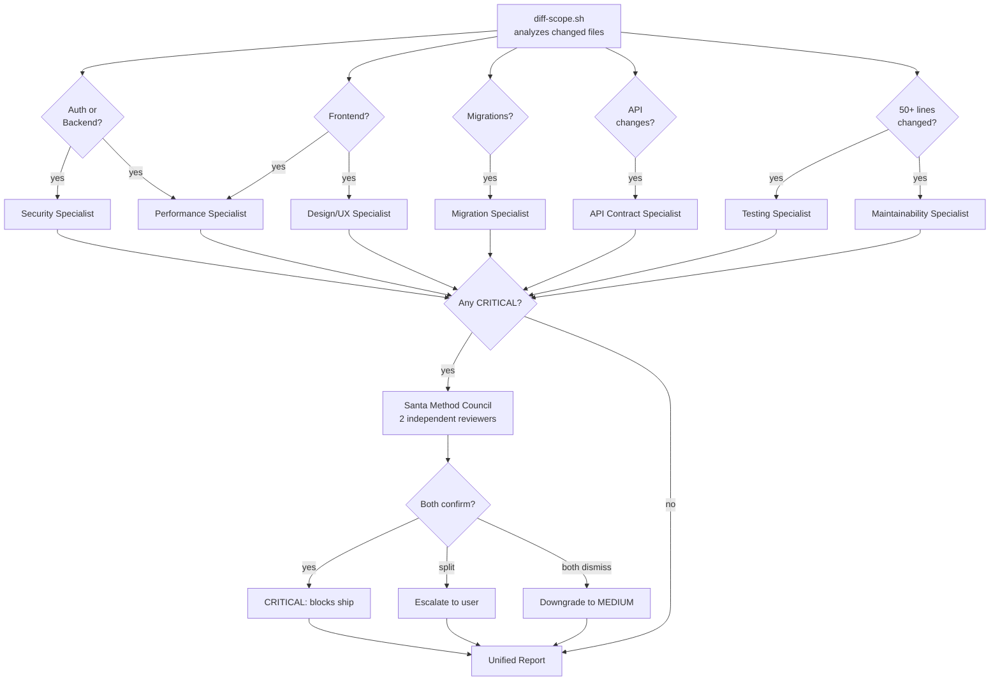

# Pipeline Diagram

## Full Sprint Pipeline



## Framework Responsibility Map

```mermaid
flowchart LR
    subgraph VALIDATE
        PL[product-lens]
        RA1[Agent: Market]
        RA2[Agent: Competitors]
        RA3[Agent: Stack]
        RA4[Agent: Risks]
    end

    subgraph PLAN
        PAUL[PAUL: /paul:plan]
        PV[Plan Validator Agent]
        CTX[CONTEXT.md Lock]
        TM[BASE: team-matrix assign]
    end

    subgraph BUILD
        CCG_P[CCG: team-plan]
        CCG_E[CCG: team-exec]
        BUILDERS[Builder Agents<br/>fresh context each]
        DIAG[Diagnostic Agent<br/>on test failure]
    end

    subgraph REVIEW
        S1[Security Specialist]
        S2[Performance Specialist]
        S3[Migration Specialist]
        S4[API Contract Specialist]
        S5[Testing Specialist]
        S6[Maintainability Specialist]
        S7[Design/UX Specialist]
        COUNCIL[Santa Method Council<br/>for CRITICAL findings]
        AEGIS[Aegis Audit]
    end

    subgraph TEST
        VM[CCG: verify-module]
        BQA[browser-qa / Playwright]
    end

    subgraph SHIP
        PS[/project:ship]
        CARL_S[CARL: decision log]
        BASE_S[BASE: state update]
        TAG[Git: pre-ship tag]
    end

    subgraph MONITOR
        CW[/canary-watch]
        BQA2[browser-qa smoke]
        LE[/learn-eval]
        SC[/skill-comply]
        FA[failure-analyzer]
    end
```

## Review Army Dispatch

The REVIEW phase dispatches specialists conditionally based on the diff scope:



## Build Wave Execution

```mermaid
flowchart TD
    PLAN_OUT[PAUL Plan] --> DECOMPOSE[/ccg:team-plan<br/>decompose into tasks]
    DECOMPOSE --> W1[Wave 1: Independent tasks<br/>run in parallel]
    W1 --> CHK1[Checkpoint wave_1]
    CHK1 --> W2[Wave 2: Depends on Wave 1<br/>run in parallel]
    W2 --> CHK2[Checkpoint wave_2]
    CHK2 --> WN[Wave N...]
    WN --> CHKN[Checkpoint wave_N]
    CHKN --> COV{Coverage >= 80%?}
    COV -- yes --> DONE[BUILD complete]
    COV -- no --> FILL[Generate targeted tests]
    FILL --> COV

    W1 --> |test fails| DIAG1[Diagnostic Agent]
    DIAG1 --> |fix + retry| W1
    DIAG1 --> |3 failures| BLOCKED1[Mark BLOCKED]
```
